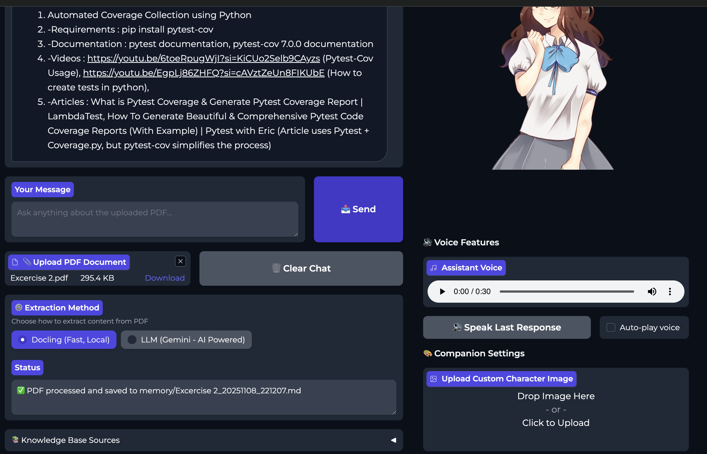
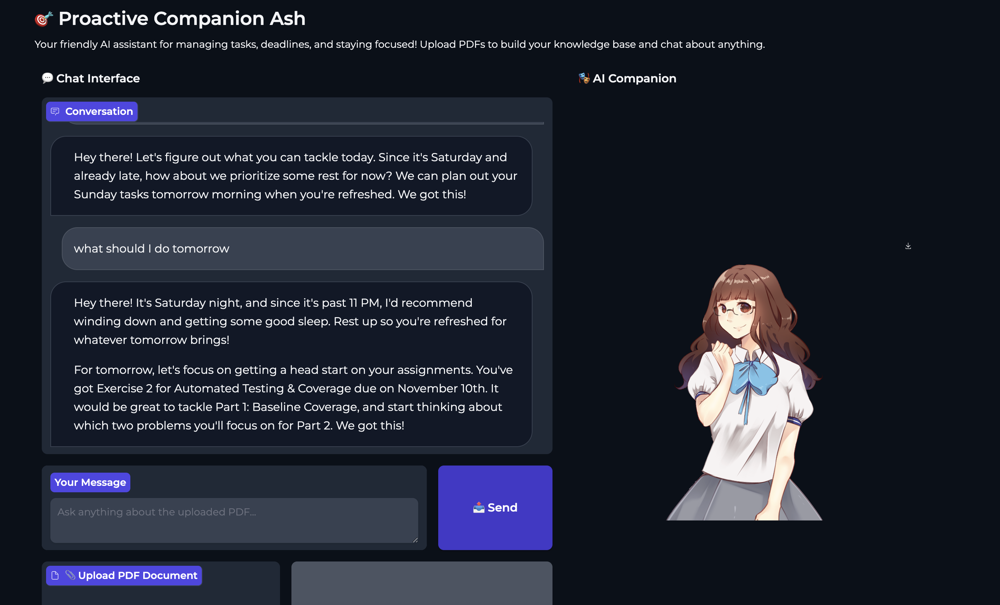
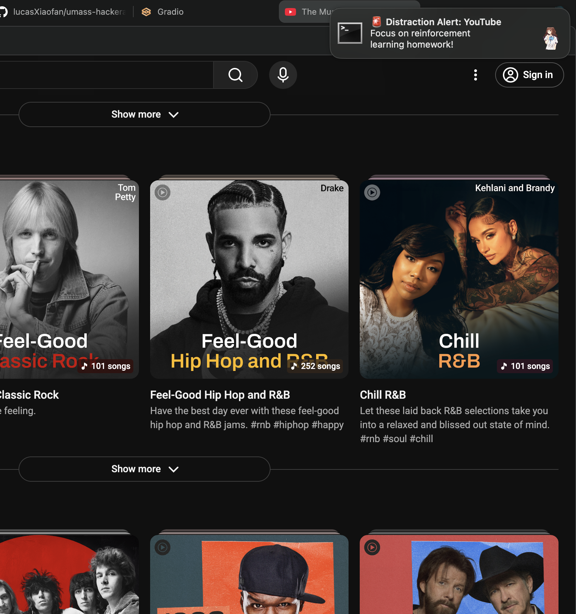

# Student Focus Assistant

## Introduction

Our motivation was to create a tool that would hold students like me accountable when we get distracted, using reminders and notifications to encourage productivity. We started with an ambitious vision packed with features, but quickly realized it wasn't realistic for the 36 hours we had. There were too many unknowns, and the scope was simply too big for our team. Once we recognized this, we scaled back to something we could actually accomplish and still be proud to present. In the end, we delivered on our original motivationa tool that helps students stay productivejust at a scope that was achievable for our group and the time we had.

This tool helps students stay focused and productive by understanding their assignments, providing intelligent task suggestions, and sending timely reminders when distractions arise.

## Quick Setup

**Note:** This project has only been tested on macOS. Compatibility with other operating systems has not been verified.

1. Clone the repository:
   ```bash
   git clone <repository-url>
   cd hackathon-umass
   ```

2. (Optional) Install `ffmpeg` for ElevenLabs voice support:
   ```bash
   # macOS
   brew install ffmpeg

   # Ubuntu/Debian
   sudo apt-get install ffmpeg

   # Windows
   # Download from https://ffmpeg.org/download.html
   ```

3. Create a `.env` file in the root directory and add your Gemini API key:
   ```
   GEMINI_API_KEY=your_api_key_here
   ```

4. Run the application using `uv` (recommended):
   ```bash
   uv run app.py
   ```

   `uv` will automatically handle dependency installation and environment management.

5. Open your browser and navigate to the provided local URL (typically `http://localhost:7860`)

## Functionalities

### 1. Quick Context Upload via PDF Extraction

Upload your course materials, assignments, or syllabi as PDFs. The tool automatically extracts and understands the content, making it easy to get started with your tasks.



### 2. Understand Your Context & Daily Planning

Based on your uploaded materials, the assistant analyzes what you need to accomplish and provides intelligent suggestions on what you should focus on for the day, helping you prioritize effectively.



### 3. Focus Notifications

When you're trying to lock in but get distracted by YouTube, Netflix, or other sites, the tool detects your distraction and sends you a notification to remind you to stay focused on your goals.




## How It Works

1. **Upload**: Share your assignments, deadlines, and course materials via PDF
2. **Understand**: The AI processes your materials and understands your workload
3. **Plan**: Get intelligent daily task suggestions based on your context
4. **Focus**: Start a focus session and let the tool monitor your progress
5. **Stay Accountable**: Receive notifications when you drift off to distracting sites


